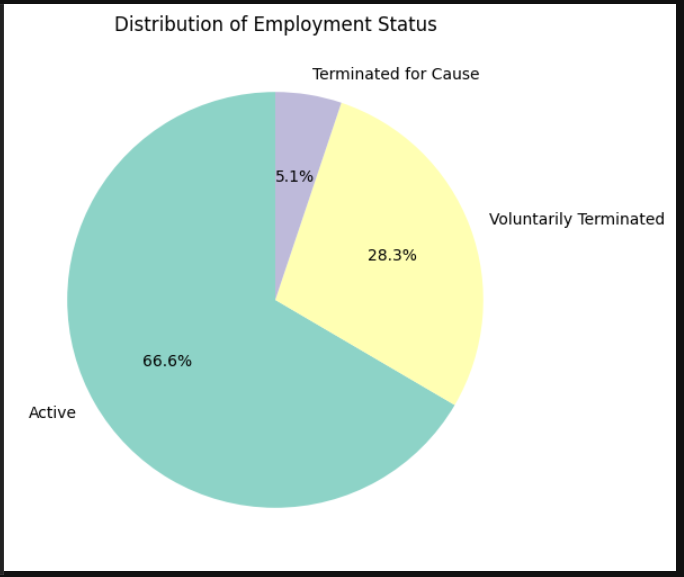

# HR Analytics EDA Project

## 📂 Table of Contents
- Overview
- Dataset Description
- Steps Performed
- Sample Visualizations
- How to Run
- Project Structure
- Author
- Datset Credits

## 📌 Project Overview

This project explores an HR dataset to analyze employee attrition trends and uncover key drivers influencing employee turnover, engagement, satisfaction, and performance. It covers both categorical and numerical variables using various data visualization techniques in Python.

---

## 🧮 Dataset Description

- **Source**: [Kaggle](HRDataset_v14.csv)
- **Total Rows**: 310
- **Key Columns**:
  - `EmploymentStatus` – Active or Terminated
  - `Age`, `Salary`, `EmpSatisfaction`, `EngagementSurvey`
  - `Department`, `Position`, `Gender`, `MaritalDesc`
  - `DateofHire`, `DateofTermination`, `ManagerID`, `PerformanceScore`

---

## 🧼 Steps Performed

1. **Data Cleaning**:
   - Handled missing values (`ManagerID`, `DateofTermination`)
   - Converted date fields to datetime
   - Created derived features like `Age`
   - Fixed 2-digit year interpretation issues

2. **Categorical Analysis**:
   - Attrition breakdown by Gender, Department, Marital Status, and Position
   - Countplots and grouped bar charts

3. **Numerical Analysis**:
   - Box and violin plots for Age, Salary, Satisfaction, Engagement
   - Explored relationships with attrition status

4. **Correlation Analysis**:
   - Heatmap of numeric features
   - Found key relationships like:
     - High engagement ↔ high satisfaction
     - Low satisfaction ↔ more absences

5. **Insights & Recommendations**:
   - Production/Sales departments have high turnover
   - Disengaged or low-paid employees more likely to leave
   - Focus on retention strategies for younger employees and underpaid roles

---

## 📊 Sample Visualizations




---

## ▶️ How to Run

1. Clone this repo  
2. Open `HR_Analytics_EDA_Project.ipynb` in Jupyter Notebook or VSCode  
3. Run all cells sequentially 

---

## 📁 Project Structure
```
hr-analytics-project/
│
├── HR_Analytics_EDA_Project.ipynb # Jupyter notebook with full analysis
├── HRDataset_v14.csv # Dataset file
├── charts/ # Folder containing saved plots
│ ├── marital status_vs_attrition.png
│ ├── correlation heatmap.png
│ ├── ...
├── README.md # This file
```

---

## 💡 Author

Rohit D.  
Aspiring Data Analyst | Transitioning into Data Science

---

## 🔗 Dataset Credits

Kaggle HR Dataset (Version 14) – For educational and non-commercial use
